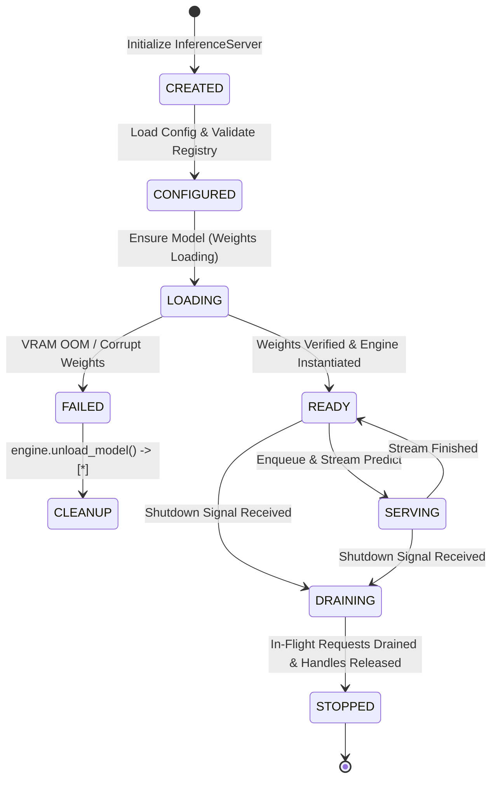

# Reactor Product API & Serving Contract Specification

This document provides the authoritative product specification and API contract for **Reactor**, classified as **`ACTIVE_PRODUCT`** (Product 3), the Cyrene Model Deployment, Serving Lifecycle, Readiness, Scaling, and Traffic Management Product.

`IMPLEMENTED_*` statuses below describe local implementation or contract
evidence only. They do not claim hosted CI, production deployment, real GPU
acceptance, or release publication. See [`PUBLICATION.md`](PUBLICATION.md).

下方 `IMPLEMENTED_*` 状态只描述本地实现或契约证据，不代表 hosted CI、生产部署、真实 GPU
验收或发布完成。详见 [`PUBLICATION.md`](PUBLICATION.md)。

---

## 1. Repository Role & Audience

- **Role**: `ACTIVE_PRODUCT` / Model Deployment, Serving Lifecycle & Inference Runtime.
- **Audience**: Inference Engineers, Serving Infrastructure Operators, SREs.
- **Implementation Status**: `IMPLEMENTED_LOCAL` (`InferenceServer`, `TaskScheduler`, direct Plugin adapter, Product extensions).

---

## 2. What Reactor Owns

Reactor is the authoritative Product owner of:
- **Serving Domain Objects**: `DeploymentSpec`, `DeploymentInstance`, `ServingPolicy`, `InferenceRequest`, `InferenceStreamChunk`, `ServingHealthStatus`.
- **Serving Lifecycle State Machine**: ArtifactRef admission $\rightarrow$ Plugin load request $\rightarrow$ ready $\rightarrow$ serving $\rightarrow$ graceful draining.
- **Product Coordination**: Request scheduling, admission backpressure, loaded-model residency, deployment reconciliation, and endpoint state.
- **Serving Policy**: Concurrency limits, streaming timeouts, and Product-owned routing decisions based on externally supplied facts.

### What Must NOT Be Implemented in Reactor
- **Model Training & Fine-Tuning**: Owned by **Yield**.
- **Model Evaluation & Scoring**: Owned by **Echo**.
- **Public API Gateway & Client Protocol Auth**: Owned by **Exchange**.
- **System-Level Hardware Probing**: Owned by **Platform Node Agent**.

---

## 3. Public Product Objects & Interfaces

```protobuf
// gRPC Inference Protocol Interface
service InferenceService {
  rpc StreamPredict (stream StreamPredictRequest) returns (stream StreamPredictResponse);
  rpc Control (ControlMessage) returns (ControlMessage);
  rpc Health (WorkerHealthRequest) returns (WorkerHealthResponse);
}
```

```python
# Direct execution-engine Plugin seam
class ExecutionEngineProvider(Protocol):
    def create(self, provider_id: str) -> BaseEngine:
        ...

class ExecutionEnginePluginResolver(Protocol):
    def resolve(self, requirement: ExecutionEngineRequirement) -> ExecutionEngineProvider:
        ...
```

The production serving profile is `DIRECT_PLUGIN`. Its binding must contain a
Platform-resolved local `CYRENE_SERVING_CONNECTION_REF`; Reactor then uses the
Plugins-owned `cyrene-plugin-runtime` `DirectPluginClient` and sends
`execution.engine.v1` JSON payloads with canonical `type.cyrene.io/...` type
URLs. An absent binding, transport failure, cancellation, deadline, or typed
protocol error becomes `ServingPortFailure`. Reactor contains no concrete
in-tree engine or compatibility fallback.

生产 serving profile 为 `DIRECT_PLUGIN`。绑定必须包含 Platform 解析出的本地
`CYRENE_SERVING_CONNECTION_REF`；Reactor 随后使用 Plugins 所有的
`cyrene-plugin-runtime` `DirectPluginClient`，发送带规范 `type.cyrene.io/...`
类型 URL 的 `execution.engine.v1` JSON 载荷。绑定缺失、传输失败、取消、超时或
类型化协议错误都会转换为 `ServingPortFailure`。Reactor 不包含本地具体引擎或兼容回退。

---

## 4. Serving Lifecycle State Map



---

## 5. Implementation Status Matrix

| Subsystem / Interface | Implementation Status | Notes |
|---|---|---|
| Core Inference Server | `IMPLEMENTED_STABLE` | `runtime/core/src/cy_exec/core/server.py`. |
| Task Scheduler & Stream Buffer | `IMPLEMENTED_STABLE` | Async streaming predict pipelines. |
| Plugins-owned Serving Engines | `LOCAL_ENDPOINT_VERIFIED` | Reactor calls `execution.engine.v1` through DirectPluginRuntime; real GPU runtime remains `NOT_RUN` for this cutover. |
| Health & Prometheus Metrics Server | `IMPLEMENTED_STABLE` | HTTP `/healthz`, `/metrics`. |
| Product Alerts & Structured Logging (Pro) | `IMPLEMENTED_STABLE` | No engine or cache implementation remains in `runtime/pro/`. |
| Platform Placement Adapter | `IMPLEMENTED_STABLE` | `components/host-placement`; no local placement scheduler or allocator. |
