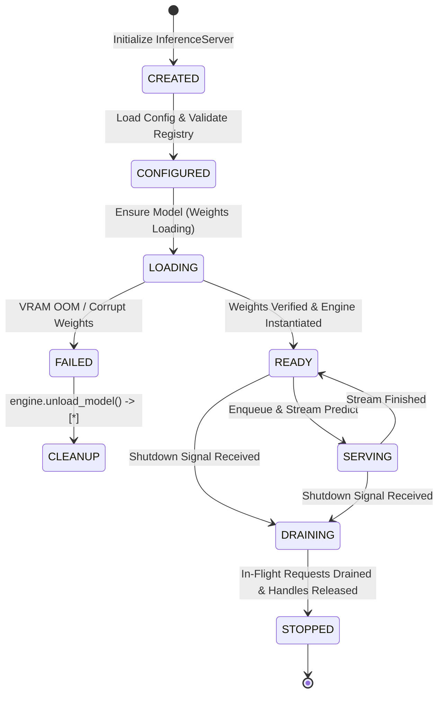
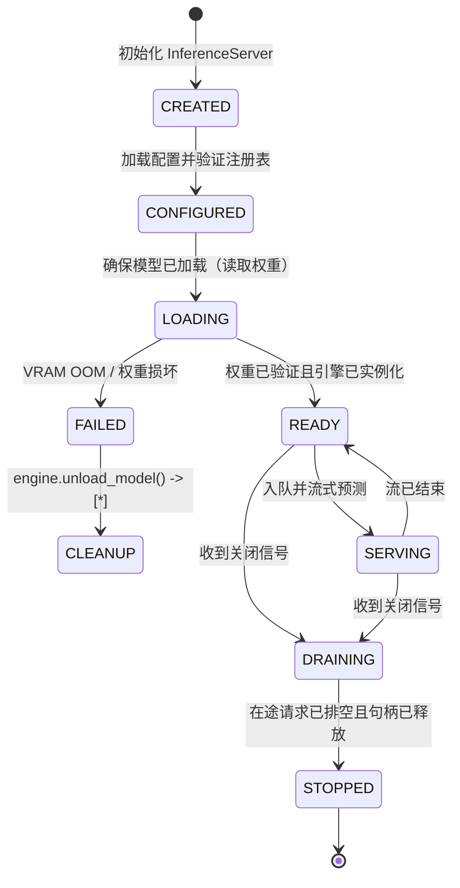

# Reactor Product API & Serving Contract Specification

This document provides the authoritative product specification and API contract for **Reactor**, classified as **`ACTIVE_PRODUCT`** (Product 3), the Cyrene Model Deployment, Serving Lifecycle, Readiness, Scaling, and Traffic Management Product.

`IMPLEMENTED_*` statuses below describe local implementation or contract
evidence only. They do not claim hosted CI, production deployment, real GPU
acceptance, or release publication. See [`PUBLICATION.md`](PUBLICATION.md).

下方 `IMPLEMENTED_*` 状态只描述本地实现或契约证据，不代表 hosted CI、生产部署、真实 GPU
验收或发布完成。详见 [`PUBLICATION.md`](PUBLICATION.md)。

---

## 1. Repository Role & Audience

- **Role**: `ACTIVE_PRODUCT` / Model Deployment, Serving Lifecycle & Inference Runtime.
- **Audience**: Inference Engineers, Serving Infrastructure Operators, SREs.
- **Implementation Status**: `IMPLEMENTED_LOCAL` (`InferenceServer`, `TaskScheduler`, direct Plugin adapter, Product extensions).

---

## 2. What Reactor Owns

Reactor is the authoritative Product owner of:
- **Serving Domain Objects**: `DeploymentSpec`, `DeploymentInstance`, `ServingPolicy`, `InferenceRequest`, `InferenceStreamChunk`, `ServingHealthStatus`.
- **Serving Lifecycle State Machine**: ArtifactRef admission $\rightarrow$ Plugin load request $\rightarrow$ ready $\rightarrow$ serving $\rightarrow$ graceful draining.
- **Product Coordination**: Request scheduling, admission backpressure, loaded-model residency, deployment reconciliation, and endpoint state.
- **Serving Policy**: Concurrency limits, streaming timeouts, and Product-owned routing decisions based on externally supplied facts.

### What Must NOT Be Implemented in Reactor
- **Model Training & Fine-Tuning**: Owned by **Yield**.
- **Model Evaluation & Scoring**: Owned by **Echo**.
- **Public API Gateway & Client Protocol Auth**: Owned by **Exchange**.
- **System-Level Hardware Probing**: Owned by **Platform Node Agent**.

---

## 3. Public Product Objects & Interfaces

```protobuf
// gRPC Inference Protocol Interface
service InferenceService {
  rpc StreamPredict (stream StreamPredictRequest) returns (stream StreamPredictResponse);
  rpc Control (ControlMessage) returns (ControlMessage);
  rpc Health (WorkerHealthRequest) returns (WorkerHealthResponse);
}
```

```python
# Direct execution-engine Plugin seam
class ExecutionEngineProvider(Protocol):
    def create(self, provider_id: str) -> BaseEngine:
        ...

class ExecutionEnginePluginResolver(Protocol):
    def resolve(self, requirement: ExecutionEngineRequirement) -> ExecutionEngineProvider:
        ...
```

The production serving profile is `DIRECT_PLUGIN`. Its binding must contain a
Platform-resolved local `CYRENE_SERVING_CONNECTION_REF`; Reactor then uses the
Plugins-owned `cyrene-plugin-runtime` `DirectPluginClient` and sends
`execution.engine.v1` JSON payloads with canonical `type.cyrene.io/...` type
URLs. An absent binding, transport failure, cancellation, deadline, or typed
protocol error becomes `ServingPortFailure`. Reactor contains no concrete
in-tree engine or compatibility fallback.

生产 serving profile 为 `DIRECT_PLUGIN`。绑定必须包含 Platform 解析出的本地
`CYRENE_SERVING_CONNECTION_REF`；Reactor 随后使用 Plugins 所有的
`cyrene-plugin-runtime` `DirectPluginClient`，发送带规范 `type.cyrene.io/...`
类型 URL 的 `execution.engine.v1` JSON 载荷。绑定缺失、传输失败、取消、超时或
类型化协议错误都会转换为 `ServingPortFailure`。Reactor 不包含本地具体引擎或兼容回退。

---

## 4. Serving Lifecycle State Map



---

## 5. Implementation Status Matrix

| Subsystem / Interface | Implementation Status | Notes |
|---|---|---|
| Core Inference Server | `IMPLEMENTED_STABLE` | `runtime/core/src/cy_exec/core/server.py`. |
| Task Scheduler & Stream Buffer | `IMPLEMENTED_STABLE` | Async streaming predict pipelines. |
| Plugins-owned Serving Engines | `LOCAL_ENDPOINT_VERIFIED` | Reactor calls `execution.engine.v1` through DirectPluginRuntime; real GPU runtime remains `NOT_RUN` for this cutover. |
| Health & Prometheus Metrics Server | `IMPLEMENTED_STABLE` | HTTP `/healthz`, `/metrics`. |
| Product Alerts & Structured Logging (Pro) | `IMPLEMENTED_STABLE` | No engine or cache implementation remains in `runtime/pro/`. |
| Platform Placement Adapter | `IMPLEMENTED_STABLE` | `components/host-placement`; no local placement scheduler or allocator. |
---
<!-- Chinese Translation / 中文翻译 -->

# Reactor Product API 与服务契约规范

本文是 **Reactor** 的权威 Product 规范和 API 契约。Reactor 被归类为 **`ACTIVE_PRODUCT`**（Product 3），负责 Cyrene 模型部署、服务生命周期、就绪状态、扩缩容和流量管理。

下文的 `IMPLEMENTED_*` 状态只说明本地实现或契约证据，不代表 hosted CI、生产部署、真实 GPU 验收或发布已完成。详见 [`PUBLICATION.md`](PUBLICATION.md)。

---

## 1. 仓库角色与读者

- **角色**：`ACTIVE_PRODUCT` / 模型部署、服务生命周期与推理运行时。
- **读者**：推理工程师、服务基础设施运维人员、SRE。
- **实现状态**：`IMPLEMENTED_LOCAL`（`InferenceServer`、`TaskScheduler`、直连 Plugin 适配器和 Product 扩展）。

---

## 2. Reactor 的职责

Reactor 是以下内容的权威 Product owner：

- **服务领域对象**：`DeploymentSpec`、`DeploymentInstance`、`ServingPolicy`、`InferenceRequest`、`InferenceStreamChunk`、`ServingHealthStatus`。
- **服务生命周期状态机**：ArtifactRef 准入 → Plugin 加载请求 → 就绪 → 服务中 → 优雅排空。
- **Product 协调**：请求调度、准入背压、已加载模型驻留、部署协调和 endpoint 状态。
- **服务策略**：并发限制、流式超时，以及基于外部事实由 Product 作出的路由决策。

### Reactor 中不得实现的内容

- **模型训练与微调**：由 **Yield** 负责。
- **模型评估与评分**：由 **Echo** 负责。
- **公共 API 网关与客户端协议认证**：由 **Exchange** 负责。
- **系统级硬件探测**：由 **Platform Node Agent** 负责。

---

## 3. 公共 Product 对象与接口

以下 gRPC 接口保持其原有协议定义：

```protobuf
// gRPC inference protocol interface
service InferenceService {
  rpc StreamPredict (stream StreamPredictRequest) returns (stream StreamPredictResponse);
  rpc Control (ControlMessage) returns (ControlMessage);
  rpc Health (WorkerHealthRequest) returns (WorkerHealthResponse);
}
```

以下 Python 协议表示直连执行引擎 Plugin 接缝：

```python
class ExecutionEngineProvider(Protocol):
    def create(self, provider_id: str) -> BaseEngine:
        ...

class ExecutionEnginePluginResolver(Protocol):
    def resolve(self, requirement: ExecutionEngineRequirement) -> ExecutionEngineProvider:
        ...
```

生产服务配置为 `DIRECT_PLUGIN`。其绑定必须包含由 Platform 解析的本地 `CYRENE_SERVING_CONNECTION_REF`。随后 Reactor 使用 Plugins 所有的 `cyrene-plugin-runtime` `DirectPluginClient`，发送带规范 `type.cyrene.io/...` 类型 URL 的 `execution.engine.v1` JSON 载荷。绑定缺失、传输失败、取消、超时或类型化协议错误都会转换为 `ServingPortFailure`。Reactor 不包含仓库内具体引擎或兼容回退。

---

## 4. 服务生命周期状态图

状态标识保持不变，箭头后的说明翻译如下：



---

## 5. 实现状态矩阵

| 子系统 / 接口 | 实现状态 | 说明 |
|---|---|---|
| 核心推理服务器 | `IMPLEMENTED_STABLE` | `runtime/core/src/cy_exec/core/server.py`。 |
| 任务调度器与流缓冲区 | `IMPLEMENTED_STABLE` | 异步流式预测流水线。 |
| Plugins 所有的服务引擎 | `LOCAL_ENDPOINT_VERIFIED` | Reactor 通过 DirectPluginRuntime 调用 `execution.engine.v1`；本次切换尚未运行真实 GPU 运行时（`NOT_RUN`）。 |
| 健康检查与 Prometheus 指标服务器 | `IMPLEMENTED_STABLE` | HTTP `/healthz`、`/metrics`。 |
| Product 告警与结构化日志（Pro） | `IMPLEMENTED_STABLE` | `runtime/pro/` 中已不再包含引擎或缓存实现。 |
| Platform 放置适配器 | `IMPLEMENTED_STABLE` | `components/host-placement`；没有本地放置调度器或分配器。 |
