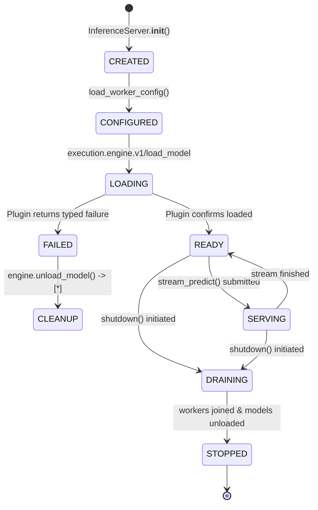
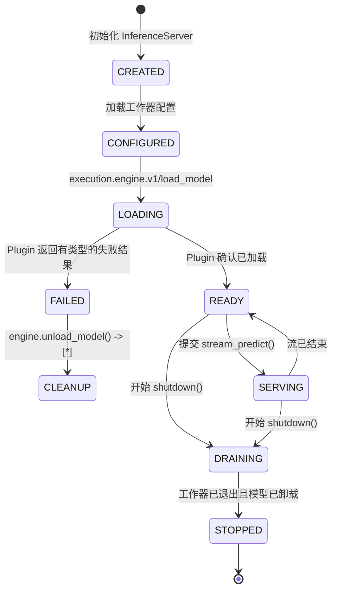

# Cyrene-Reactor Architecture & Lifecycle Specification

## 1. Overview & Service Boundary

`Cyrene-Reactor` is the official **Model Inference and Serving Product Service** in the Cyrene ecosystem. It consumes runtime foundations and mechanisms provided by `Cyrene-Platform` and replaceable engine plugins, composing them into high-performance serving endpoints (gRPC / HTTP).

---

## 2. Current Implementation (As-Is) vs. Target Product Responsibility (To-Be)

| Dimension | Current Implementation (As-Is) | Target Product Responsibility (To-Be) |
|---|---|---|
| **Serving Runtime** | `runtime/core` (`cy_exec`): Product coordinator with a fail-closed `DIRECT_PLUGIN` binding through the Plugins-owned `DirectPluginClient`; no concrete engine implementation | Unified, resilient inference serving worker with full dynamic batching and streaming |
| **Lifecycle & Health** | State-aware health server (`/healthz`, `/metrics`), graceful draining, and cleanup on failed model load | First-class `WorkerControl` integration via Platform lifecycle channels |
| **Scheduling & Backpressure** | Priority-aware `TaskScheduler` with queue limits and thread workers | Adaptive GPU admission control, token-bucket rate limiting, and request preemption |
| **Model Residency** | Per-server registry of loaded Plugin handles, explicit unload, and optional Plugin-reported memory observations | Multi-model policy driven by Platform facts and Plugin observations |
| **Pro Extensions** | `runtime/pro` (`cy_exec_pro`): Product-side alerts and structured logging only | Enterprise serving policy without concrete engine, cache, or provider implementations |
| **Placement Integration** | `components/host-placement`: thin adapter to Platform-owned placement | Consume Platform placement facts without a second scheduler or allocator |

---

## 3. Serving Lifecycle State Map

### Lifecycle Transition Classifications

1. **`CREATE` (`InferenceServer.__init__`)**: `CORRECT` — Initializes the bounded request scheduler, model-residency tracker, and telemetry.
2. **`CONFIGURE` (`load_worker_config`)**: `LOCAL_PRODUCT_LOGIC` — Validates model registry, TLS config, and tokens.
3. **`LOAD` (`ensure_model`)**: `DIRECT_PLUGIN` — One typed load request; Product does not select engines, inspect weights, or rewrite settings after failure.
4. **`READY` / `HEALTH` (`health_server.py`)**: `CORRECT` (Hardened) — Returns HTTP 200 when active; returns HTTP 503 Fail-Closed on error or shutdown.
5. **`SERVE` (`stream_predict`)**: `CORRECT` — Enqueues to `TaskScheduler`, performs streaming inference, catches stream errors.
6. **`DRAIN` / `STOP` (`InferenceServer.shutdown`)**: `CORRECT` (Hardened) — Sets `_is_shutting_down = True`, rejects new traffic, stops scheduler workers, unloads all active model handles.
7. **`FAIL` / `CLEANUP`**: `CORRECT` (Hardened) — On load failure, immediately invokes `engine.unload_model()` so the selected Plugin can release its runtime resources.

---

## 4. Platform Dependencies & Plugins-owned Implementations

### Platform Dependencies (Mechanisms to be consumed from `Cyrene-Platform`):
- **`WorkerControl` Channel**: Protocol for platform supervisor to instruct worker start/stop/health probe.
- **`ModelManifest` / `WorkloadRequest`**: Standard type definitions for model declarations (typing-only in ABCs).
- **`HardwareFacts`**: System-level hardware probing (eliminating duplicate local `nvidia-smi` wrappers).

The serving data plane is not a Platform dependency: after Platform resolves a
local `connection_ref`, Reactor opens the endpoint with the immutable
Plugins-owned `cyrene-plugin-runtime` SDK and sends `execution.engine.v1`
payloads directly.

Serving data plane 不经过 Platform：Platform 解析出本地 `connection_ref` 后，Reactor
使用固定版本的 Plugins 所有 `cyrene-plugin-runtime` SDK 打开端点，直接发送
`execution.engine.v1` 载荷。

### Plugins-owned implementations:
- **`cyrene.engines.vllm`**: Concrete vLLM and LoRA execution adapter.
- **`cyrene.engines.tensorrt-llm`**: Concrete TensorRT-LLM execution adapter.
- **`cyrene.engines.ascend-mindie`**: Concrete Huawei Ascend / MindIE execution adapter.

---

## 5. Memory & KV Cache Ownership Boundaries (Canonical Freeze)

- **`Cyrene-Platform` owns**:
  - GPU/hardware device allocation and physical slicing.
  - Node-level `HardwareFacts` (canonical source: Node Agent inventory).
  - Workload resource lease lifecycle and capacity reservations.
  - *Platform does NOT own serving-specific KV Cache semantics.*
- **`Cyrene-Reactor` owns**:
  - Serving coordination, loaded-model identity, and explicit unload policy.
  - Aggregation of optional memory observations reported by selected Plugins.
  - Request admission control and queue backpressure.
- **Engine Plugins (e.g. `vllm-engine`, `tensorrt-engine`) own**:
  - Concrete KV block allocation and PagedAttention kernel execution.
  - Prefix cache implementation and GPU memory pool paging.
- **Gateway cache Plugins own**:
  - Prompt/response cache keys, TTL, persistence, eviction, and cache telemetry.

Reactor no longer contains a prompt cache, KV-cache manager, topology scheduler,
or hardware probe. Its retained `TaskScheduler` is only an in-worker bounded
request queue; it is not package scheduling, placement, or resource allocation.
---
<!-- Chinese Translation / 中文翻译 -->

# Cyrene-Reactor 架构与生命周期规范

## 1. 概览与服务边界

`Cyrene-Reactor` 是 Cyrene 生态中的官方 **模型推理与服务 Product 服务**。它使用 `Cyrene-Platform` 提供的运行时基础和机制，并组合可替换的引擎插件，构建高性能服务端点（gRPC / HTTP）。

---

## 2. 当前实现（As-Is）与目标 Product 职责（To-Be）

| 维度 | 当前实现（As-Is） | 目标 Product 职责（To-Be） |
|---|---|---|
| **服务运行时** | `runtime/core`（`cy_exec`）：Product 协调器，通过 Plugins 所有的 `DirectPluginClient` 使用失败即拒绝的 `DIRECT_PLUGIN` 绑定；不包含具体引擎实现 | 统一且具备韧性的推理服务工作进程，支持完整动态批处理和流式处理 |
| **生命周期与健康** | 感知状态的健康服务器（`/healthz`、`/metrics`）、优雅排空，以及模型加载失败时的清理 | 通过 Platform 生命周期通道一等集成 `WorkerControl` |
| **调度与背压** | 感知优先级的 `TaskScheduler`，具有队列上限和线程工作器 | 自适应 GPU 准入控制、令牌桶限速和请求抢占 |
| **模型驻留** | 每服务实例的已加载 Plugin 句柄注册表、显式卸载，以及可选的 Plugin 内存观测 | 由 Platform 事实和 Plugin 观测驱动的多模型策略 |
| **Pro 扩展** | `runtime/pro`（`cy_exec_pro`）：仅有 Product 侧告警和结构化日志 | 企业级服务策略，不包含具体引擎、缓存或提供方实现 |
| **放置集成** | `components/host-placement`：连接 Platform 所有放置能力的轻量适配器 | 使用 Platform 放置事实，不再引入第二个调度器或分配器 |

---

## 3. 服务生命周期状态图

状态标识保持不变，转换标签翻译如下：

### 生命周期转换分类

1. **`CREATE`（`InferenceServer.__init__`）**：`CORRECT` — 初始化有界请求调度器、模型驻留跟踪器和遥测。
2. **`CONFIGURE`（`load_worker_config`）**：`LOCAL_PRODUCT_LOGIC` — 验证模型注册表、TLS 配置和令牌。
3. **`LOAD`（`ensure_model`）**：`DIRECT_PLUGIN` — 发送一个有类型的加载请求；Product 不选择引擎、不检查权重，也不会在失败后改写设置。
4. **`READY` / `HEALTH`（`health_server.py`）**：`CORRECT`（已加固）— 活动时返回 HTTP 200；发生错误或正在关闭时失败即拒绝并返回 HTTP 503。
5. **`SERVE`（`stream_predict`）**：`CORRECT` — 将请求放入 `TaskScheduler`，执行流式推理并捕获流错误。
6. **`DRAIN` / `STOP`（`InferenceServer.shutdown`）**：`CORRECT`（已加固）— 设置 `_is_shutting_down = True`，拒绝新流量，停止调度器工作线程，并卸载所有活动模型句柄。
7. **`FAIL` / `CLEANUP`**：`CORRECT`（已加固）— 模型加载失败时立即调用 `engine.unload_model()`，让选定的 Plugin 释放其运行时资源。

---

## 4. Platform 依赖与 Plugins 所有的实现

### Platform 依赖（从 `Cyrene-Platform` 使用的机制）

- **`WorkerControl` 通道**：Platform 监管器指示工作进程启动、停止和接受健康探测的协议。
- **`ModelManifest` / `WorkloadRequest`**：模型声明的标准类型定义（仅在 ABC 中用于类型声明）。
- **`HardwareFacts`**：系统级硬件探测（消除重复的本地 `nvidia-smi` 包装器）。

服务数据平面不是 Platform 依赖：Platform 解析出本地 `connection_ref` 后，Reactor 使用不可变的、由 Plugins 所有的 `cyrene-plugin-runtime` SDK 打开端点，并直接发送 `execution.engine.v1` 载荷。

### Plugins 所有的实现

- **`cyrene.engines.vllm`**：具体的 vLLM 和 LoRA 执行适配器。
- **`cyrene.engines.tensorrt-llm`**：具体的 TensorRT-LLM 执行适配器。
- **`cyrene.engines.ascend-mindie`**：具体的华为 Ascend / MindIE 执行适配器。

---

## 5. Memory 与 KV Cache 所有权边界（规范冻结）

- **`Cyrene-Platform` 所有：**
  - GPU/硬件设备分配和物理切分。
  - Node 级 `HardwareFacts`（规范来源：Node Agent 清单）。
  - 工作负载资源 lease 生命周期和容量预留。
  - *Platform 不拥有服务专属的 KV Cache 语义。*
- **`Cyrene-Reactor` 所有：**
  - 服务协调、已加载模型标识和显式卸载策略。
  - 汇总选定 Plugin 可选上报的内存观测。
  - 请求准入控制和队列背压。
- **引擎 Plugin（例如 `vllm-engine`、`tensorrt-engine`）所有：**
  - 具体 KV block 分配和 PagedAttention 内核执行。
  - Prefix cache 实现和 GPU 内存池分页。
- **Gateway cache Plugin 所有：**
  - Prompt/response cache key、TTL、持久化、淘汰和缓存遥测。

Reactor 已不再包含 prompt cache、KV-cache 管理器、拓扑调度器或硬件探测。保留下来的 `TaskScheduler` 仅是在工作进程内部使用的有界请求队列；它不是软件包调度、放置或资源分配机制。
