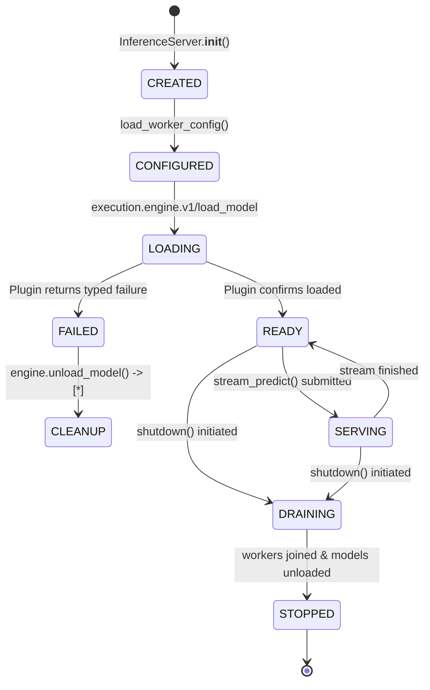

# Cyrene-Reactor Architecture & Lifecycle Specification

## 1. Overview & Service Boundary

`Cyrene-Reactor` is the official **Model Inference and Serving Product Service** in the Cyrene ecosystem. It consumes runtime foundations and mechanisms provided by `Cyrene-Platform` and replaceable engine plugins, composing them into high-performance serving endpoints (gRPC / HTTP).

---

## 2. Current Implementation (As-Is) vs. Target Product Responsibility (To-Be)

| Dimension | Current Implementation (As-Is) | Target Product Responsibility (To-Be) |
|---|---|---|
| **Serving Runtime** | `runtime/core` (`cy_exec`): Product coordinator with a fail-closed `DIRECT_PLUGIN` binding through the Plugins-owned `DirectPluginClient`; no concrete engine implementation | Unified, resilient inference serving worker with full dynamic batching and streaming |
| **Lifecycle & Health** | State-aware health server (`/healthz`, `/metrics`), graceful draining, and cleanup on failed model load | First-class `WorkerControl` integration via Platform lifecycle channels |
| **Scheduling & Backpressure** | Priority-aware `TaskScheduler` with queue limits and thread workers | Adaptive GPU admission control, token-bucket rate limiting, and request preemption |
| **Model Residency** | Per-server registry of loaded Plugin handles, explicit unload, and optional Plugin-reported memory observations | Multi-model policy driven by Platform facts and Plugin observations |
| **Pro Extensions** | `runtime/pro` (`cy_exec_pro`): Product-side alerts and structured logging only | Enterprise serving policy without concrete engine, cache, or provider implementations |
| **Placement Integration** | `components/host-placement`: thin adapter to Platform-owned placement | Consume Platform placement facts without a second scheduler or allocator |

---

## 3. Serving Lifecycle State Map

### Lifecycle Transition Classifications

1. **`CREATE` (`InferenceServer.__init__`)**: `CORRECT` — Initializes the bounded request scheduler, model-residency tracker, and telemetry.
2. **`CONFIGURE` (`load_worker_config`)**: `LOCAL_PRODUCT_LOGIC` — Validates model registry, TLS config, and tokens.
3. **`LOAD` (`ensure_model`)**: `DIRECT_PLUGIN` — One typed load request; Product does not select engines, inspect weights, or rewrite settings after failure.
4. **`READY` / `HEALTH` (`health_server.py`)**: `CORRECT` (Hardened) — Returns HTTP 200 when active; returns HTTP 503 Fail-Closed on error or shutdown.
5. **`SERVE` (`stream_predict`)**: `CORRECT` — Enqueues to `TaskScheduler`, performs streaming inference, catches stream errors.
6. **`DRAIN` / `STOP` (`InferenceServer.shutdown`)**: `CORRECT` (Hardened) — Sets `_is_shutting_down = True`, rejects new traffic, stops scheduler workers, unloads all active model handles.
7. **`FAIL` / `CLEANUP`**: `CORRECT` (Hardened) — On load failure, immediately invokes `engine.unload_model()` so the selected Plugin can release its runtime resources.

---

## 4. Platform Dependencies & Plugins-owned Implementations

### Platform Dependencies (Mechanisms to be consumed from `Cyrene-Platform`):
- **`WorkerControl` Channel**: Protocol for platform supervisor to instruct worker start/stop/health probe.
- **`ModelManifest` / `WorkloadRequest`**: Standard type definitions for model declarations (typing-only in ABCs).
- **`HardwareFacts`**: System-level hardware probing (eliminating duplicate local `nvidia-smi` wrappers).

The serving data plane is not a Platform dependency: after Platform resolves a
local `connection_ref`, Reactor opens the endpoint with the immutable
Plugins-owned `cyrene-plugin-runtime` SDK and sends `execution.engine.v1`
payloads directly.

Serving data plane 不经过 Platform：Platform 解析出本地 `connection_ref` 后，Reactor
使用固定版本的 Plugins 所有 `cyrene-plugin-runtime` SDK 打开端点，直接发送
`execution.engine.v1` 载荷。

### Plugins-owned implementations:
- **`cyrene.engines.vllm`**: Concrete vLLM and LoRA execution adapter.
- **`cyrene.engines.tensorrt-llm`**: Concrete TensorRT-LLM execution adapter.
- **`cyrene.engines.ascend-mindie`**: Concrete Huawei Ascend / MindIE execution adapter.

---

## 5. Memory & KV Cache Ownership Boundaries (Canonical Freeze)

- **`Cyrene-Platform` owns**:
  - GPU/hardware device allocation and physical slicing.
  - Node-level `HardwareFacts` (canonical source: Node Agent inventory).
  - Workload resource lease lifecycle and capacity reservations.
  - *Platform does NOT own serving-specific KV Cache semantics.*
- **`Cyrene-Reactor` owns**:
  - Serving coordination, loaded-model identity, and explicit unload policy.
  - Aggregation of optional memory observations reported by selected Plugins.
  - Request admission control and queue backpressure.
- **Engine Plugins (e.g. `vllm-engine`, `tensorrt-engine`) own**:
  - Concrete KV block allocation and PagedAttention kernel execution.
  - Prefix cache implementation and GPU memory pool paging.
- **Gateway cache Plugins own**:
  - Prompt/response cache keys, TTL, persistence, eviction, and cache telemetry.

Reactor no longer contains a prompt cache, KV-cache manager, topology scheduler,
or hardware probe. Its retained `TaskScheduler` is only an in-worker bounded
request queue; it is not package scheduling, placement, or resource allocation.
