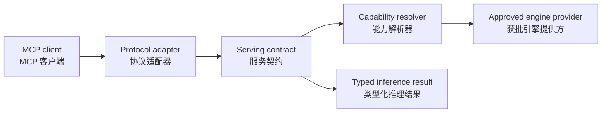
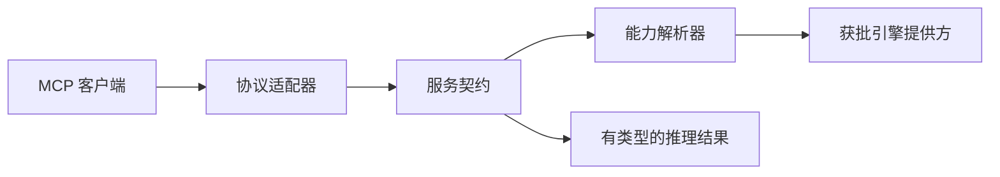

# MCP integration / MCP 集成

## Current posture / 当前状态

Reactor's primary serving boundary is gRPC/HTTP rather than MCP. Any future MCP-facing tool or model adapter must remain a thin protocol translation layer over the existing serving and capability contracts.

Reactor 的主要服务边界是 gRPC/HTTP，而不是 MCP。未来任何面向 MCP 的工具或模型适配器，都必须是现有服务与能力契约之上的薄协议转换层。

## Intended adapter boundary / 预期适配边界

The adapter should validate model identity, request limits, streaming mode, and authorization context before dispatch. It should not expose arbitrary engine internals, process controls, or filesystem operations.

适配器应在分发前校验模型身份、请求限制、流式模式与授权上下文。不应暴露任意引擎内部细节、进程控制或文件系统操作。

## Review checklist / 评审清单

- Keep MCP transport errors separate from serving and engine errors.
- Reuse the same request admission, timeout, cancellation, and health policy as native protocols.
- Preserve model and engine identity for reproducible diagnostics.
- Do not bypass capability resolution or approval policy for convenience.
- Never place secrets or unrestricted raw traces in protocol responses.

- 将 MCP 传输错误与服务错误、引擎错误分开。
- 与原生协议复用相同的请求准入、超时、取消与健康策略。
- 保留模型与引擎身份，便于复现诊断。
- 不得为方便而绕过能力解析或审批策略。
- 绝不能在协议响应中放入密钥或不受限制的原始追踪信息。
---
<!-- Chinese Translation / 中文翻译 -->

# MCP 集成

## 当前状态

Reactor 的主要服务边界是 gRPC/HTTP，而非 MCP。未来任何面向 MCP 的工具或模型适配器都必须是现有服务和能力契约上的轻量协议转换层。

## 预期适配器边界

适配器应在分发前验证模型身份、请求限制、流式模式和授权上下文。它不应暴露任意引擎内部细节、进程控制或文件系统操作。

## 评审清单

- 将 MCP 传输错误与服务错误、引擎错误分开。
- 与原生协议复用相同的请求准入、超时、取消和健康策略。
- 保留模型和引擎标识，确保诊断可复现。
- 不得为了方便绕过能力解析或审批策略。
- 绝不能在协议响应中放入密钥或不受限制的原始追踪记录。
