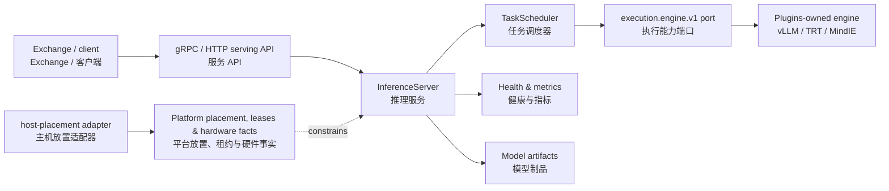

# Reactor architecture overview / Reactor 架构概览

## Role and boundary / 角色与边界

Reactor turns admitted model artifacts into serving workers. It owns Product serving semantics—deployment state, readiness, bounded request scheduling, streaming, backpressure, loaded-model residency, and graceful draining—while Platform owns generic execution substrate, placement, leases, and node facts.

Reactor 将获准的模型制品转化为服务工作器。它负责 Product 服务语义——部署状态、就绪、有界请求调度、流式输出、背压、已加载模型驻留与优雅排空；Platform 负责通用执行底座、放置、租约与节点事实。

## Runtime topology / 运行时拓扑

The in-tree Python runtime is the Product authority for request behavior. It
does not contain an engine, prompt cache, KV-cache manager, topology scheduler,
or hardware probe. The retained Rust component only adapts Reactor inputs to
Platform placement.

树内 Python 运行时是请求行为的 Product 权威，不包含引擎、Prompt 缓存、KV-cache
管理器、拓扑调度器或硬件探测。保留的 Rust 组件只把 Reactor 输入适配给 Platform 放置接口。

## Serving lifecycle / 服务生命周期

| State | Meaning / 含义 | Important boundary / 关键边界 |
|---|---|---|
| `CREATED` | Server and coordination objects exist / 服务与协调对象已创建 | No traffic is accepted yet / 尚未接受流量 |
| `CONFIGURED` | Configuration and registry inputs pass validation / 配置与注册表输入校验通过 | Model requirements are known / 模型要求已确定 |
| `LOADING` | Weights and engine are being prepared / 正在准备权重与引擎 | Failure must release engine resources / 失败时必须释放引擎资源 |
| `READY` | Model is loaded and health is positive / 模型已加载且健康 | Admission can accept work / 可以准入请求 |
| `SERVING` | Requests are queued and streamed / 请求排队并流式返回 | Backpressure and timeouts apply / 应用背压与超时 |
| `DRAINING` | New traffic is rejected while work completes / 拒绝新流量并等待存量完成 | Handles and workers are released / 释放句柄与工作器 |
| `STOPPED` | Serving resources are closed / 服务资源已关闭 | No new work may start / 不得启动新任务 |

## Ownership boundaries / 归属边界

- Reactor owns deployment/endpoint state, serving policy, bounded in-worker request scheduling, worker control, and loaded-model residency.
- Engine providers own concrete inference execution and engine-specific cache primitives.
- Platform owns generic process lifecycle, resource leases, and canonical hardware facts.
- Exchange owns public gateway behavior and client-protocol authentication.
- Yield owns training and fine-tuning; Echo owns evaluation and scoring.

- Reactor 负责部署/端点状态、服务策略、工作器内有界请求调度、工作器控制与已加载模型驻留。
- 引擎提供方负责具体推理执行与引擎专属缓存基础设施。
- Platform 负责通用进程生命周期、资源租约与标准硬件事实。
- Exchange 负责公共网关行为与客户端协议认证。
- Yield 负责训练与微调；Echo 负责评估与评分。
