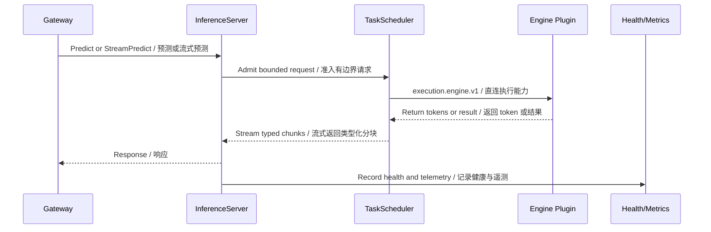

# Tool and capability system / 工具与能力系统

## Engine capability model / 引擎能力模型

Reactor resolves serving engines through one versioned capability binding rather than embedding or selecting vendor implementations.

Reactor 通过一个版本化能力绑定解析服务引擎，不再内嵌或选择厂商实现。

| Surface | Responsibility / 职责 | Source area / 源码区域 |
|---|---|---|
| `ServingEngineProvider` | Create a compatible serving engine / 创建兼容的服务引擎 | `runtime/core/src/cy_exec/capability_seam.py` |
| `TaskScheduler` | Bound one worker's request queue and apply backpressure / 约束单个工作器的请求队列并实施背压 | `runtime/core/src/cy_exec/core/` |
| Host-placement adapter | Submit placement inputs to Platform without reimplementing placement / 向 Platform 提交放置输入，不重复实现放置算法 | `components/host-placement/` |

## Request path / 请求路径

## Non-ownership rules / 非归属规则

- Do not move generic hardware probing into Reactor when Platform Node Agent owns the facts.
- Do not make an engine plugin the authority for deployment state or request lifecycle.
- Keep loaded-model residency policy in Reactor; prompt caching and concrete KV allocation remain Plugin-owned.
- Preserve fail-closed health and graceful-drain behavior across adapters.
- Treat generated protobuf modules as outputs of contract tooling, not hand-maintained implementation files.

- Platform Node Agent 负责硬件事实时，不要将通用硬件探测移入 Reactor。
- 引擎插件不能成为部署状态或请求生命周期的权威。
- 已加载模型的驻留策略由 Reactor 负责；Prompt 缓存与具体 KV 分配仍由插件实现负责。
- 各适配器都必须保持故障关闭的健康状态与优雅排空行为。
- 生成的 protobuf 模块是契约工具的输出，不是手工维护的实现文件。
